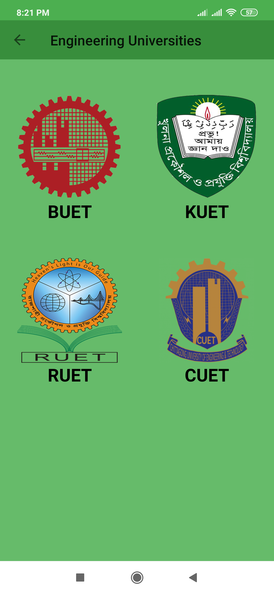

# Admission Informer App
QAAi(Quick Access Admission Informer) App or **Admission Informer** App in short is a Native Android Application.It is developed for the purpose of providing authentic University Admission Test Information of Bangladesh.Every year thousands of students take part in admission test in Bangladesh to get themselves admitted. For this, they need all the information regarding the university but as most of the students don't know from where they can get the informations or sometimes they really find it difficult to search universities all the time because they have to browse every particular university daily which is really time consuming.As a helping hand, **Admission Informer** app will provide all the necessary informations of university admission like admission circular,application,criteria,procedure, deadline,fees,admit card details,result etc.This app will also provide information through notifications so that students don't have to search daily.We have a vision to connect  large number of students through this initiative and it will be continued.

<!-- ## Playstore Link: 
 https://play.google.com/store/apps/details?id=com.informer.habibcse25.qaai&fbclid=IwAR0Yz9AUQ9XzpVRiHUbiLyyY9loLsIJsWJEPRwHJQ40AC4z60aURH_nLS04 -->

## Technical Info:
**Type :** Native Android Application  
**IDE :** Android Studio  
**Database :** Firebase  
**Compatibility :** Android  

## Features:

| Splash Screen |  Home |  Navigation Drawer |  Dashboard |
| --------------- | --------------- | --------------- | --------------- |
|  |  |  |  |
| Interface   |  Firebase Data Fetch |  Interface  |  Firebase Data Fetch             |
| |  |  | | 

